##  Table of Contents

1. [Introduction to Semiconductor Packaging](#introduction-to-semiconductor-packaging)  
2. [Part I: Packaging Evolution – From Basics to 3D Integration](#part-i-packaging-evolution--from-basics-to-3d-integration)  
   - [Industry Overview and Packaging Fundamentals](#industry-overview-and-packaging-fundamentals)  
   - [Understanding Package Requirements and Foundational Package Types](#understanding-package-requirements-and-foundational-package-types)  
   - [Evolving Package Architectures from Single-Chip to Multi-Chip Modules](#evolving-package-architectures-from-single-chip-to-multi-chip-modules)  
   - [Interposers, Redistribution Layers, and 3D Packaging Approaches](#interposers-redistribution-layers-and-3d-packaging-approaches)  
   - [Comparative Analysis and Selecting the Right Packaging Solution](#comparative-analysis-and-selecting-the-right-packaging-solution)  
3. [Part II: From Wafer to Package – Assembly and Manufacturing Essentials](#part-ii-from-wafer-to-package--assembly-and-manufacturing-essentials)  
   - [Wafer-Level Processing and Testing](#wafer-level-processing-and-testing)  
   - [Die Preparation](#die-preparation)  
   - [Die Attach](#die-attach)  
   - [Wire Bonding and Flip Chip Attachment](#wire-bonding-and-flip-chip-attachment)  
   - [Encapsulation and Molding](#encapsulation-and-molding)  
   - [Testing and Inspection](#testing-and-inspection)  
   - [Final Assembly and Marking](#final-assembly-and-marking)  
   - [Quality and Reliability Assurance](#quality-and-reliability-assurance)  
4. [Labs: Thermal Simulation of Semiconductor Packages with ANSYS](#labs-thermal-simulation-of-semiconductor-packages-with-ansys)  
   - [Introduction to ANSYS Electronics Desktop (AEDT)](#introduction-to-ansys-electronics-desktop-aedt)  
   - [Setting Up A Flip-Chip BGA Package](#setting-up-a-flip-chip-bga-package)  
   - [Meshing and Analysis](#meshing-and-analysis)  
5. [Part III: Semiconductor Package Testing & Modeling with ANSYS](#part-iii-semiconductor-package-testing--modeling-with-ansys)  
   - [Package Testing & Reliability](#package-testing--reliability)  
   - [Reliability Tests](#reliability-tests)  
   - [Package Modeling in ANSYS AEDT](#package-modeling-in-ansys-aedt)  
6. [Creating Dice and Substrate in AEDT](#creating-dice-and-substrate-in-aedt)  
   - [Steps to Create a Die in ANSYS Electronics Desktop (AEDT)](#steps-to-create-a-die-in-ansys-electronics-desktop-aedt)  
   - [Analysis and Results](#analysis-and-results)  

---
# Introduction to Semiconductor Packaging

Semiconductor packaging is the final frontier of innovation that protects, connects, and integrates chips into usable electronic components. This document covers both the **evolution of package technologies** and the **step-by-step process of transforming wafers into final packages**.

---

## Part I: Packaging Evolution – From Basics to 3D Integration

###  Industry Overview and Packaging Fundamentals

Semiconductor packaging serves as a protective and functional interface between the delicate silicon die and the external environment. Key functions include:

- **Protection**: Shields the die from physical damage, moisture, dust, and corrosion.
- **Electrical Connectivity**: Provides pathways (pins, balls, leads) for power and signal transmission.
- **Thermal Management**: Dissipates heat generated during operation to maintain performance and longevity.

> **Real-World Example**  
> Apple's A-series chips (e.g., A14, A15, A16 Bionic) utilize System in Package (SiP) configurations with Ball Grid Array (BGA) connections, ensuring compactness and efficient integration in devices like iPhones.

**Industry Segments**:

- **Fabless Companies**: Design chips but outsource manufacturing (e.g., Qualcomm, AMD, NVIDIA).
- **Foundries**: Manufacture chips based on external designs (e.g., TSMC, Samsung).
- **OSAT (Outsourced Semiconductor Assembly and Test)**: Specialize in packaging and testing (e.g., ASE Group, Amkor Technology).
- **IDM (Integrated Device Manufacturer)**: Handle design, manufacturing, assembly, and testing in-house (e.g., Intel).

---

###  Understanding Package Requirements and Foundational Package Types

Selecting an appropriate package involves balancing multiple factors:

- **Electrical Connectivity**: Ensuring sufficient interconnects for high-speed communication.
- **Thermal Requirements**: Managing heat effectively, especially in high-temperature operations.
- **Form Factor**: Adhering to space constraints on the PCB.
- **Durability and Reliability**: Choosing materials that withstand environmental stresses.
- **Cost**: Balancing performance needs with budget constraints.

**Typical Package Structure**:

- **Die**: Mounted on a substrate or carrier.
- **Interconnections**: Established via bond wires or bumps.
- **Substrate**: Provides mechanical support and routing.
- **Molding Compound**: Encapsulates the assembly for protection.

**Mounting Technologies**:

- **Through-Hole Mounting (THM)**: Component leads pass through PCB holes and are soldered on the opposite side.
- **Surface Mount Technology (SMT)**: Components are mounted directly onto the PCB surface using solder paste.

---

### Evolving Package Architectures from Single-Chip to Multi-Chip Modules

#### Leadframe-Based Packages

- **Structure**: Metal leadframe with a die pad and leads.
- **Common Types**:
  - **DIP** (Dual In-line Package)
  - **SOP** (Small Outline Package)
  - **QFP** (Quad Flat Package)
  - **QFN** (Quad Flat No-lead)
- **Advantages**: Cost-effective, mature technology, good electrical performance.
- **Limitations**: Limited I/O density, may not meet high-performance requirements.

#### Laminate-Based Packages

- **Structure**: Multi-layer organic substrate supporting the die.
- **Common Types**:
  - **PBGA** (Plastic Ball Grid Array)
  - **Flip Chip PBGA**
  - **LGA** (Land Grid Array)
- **Advantages**: High I/O density, better electrical performance, compact form factor.
- **Challenges**: Higher cost, moisture sensitivity, complex assembly.

#### Advanced Package Substrates

- **2D**: Multiple dies placed side by side on a single substrate.
- **2.1D**: Includes a Redistribution Layer (RDL) for improved routing.
- **2.3D**: Uses an organic interposer to connect dies.
- **2.5D**: Incorporates a silicon interposer (e.g., TSMC CoWoS).

---

###  Interposers, Redistribution Layers, and 3D Packaging Approaches

#### Redistribution Layers (RDL)

- **Function**: Reroute I/O pads to new locations.
- **Applications**: Fan-out WLP, panel-level packaging, multi-die integration.

#### Interposers

- **Function**: Intermediate routing layer.
- **Types**:
  - **Passive**: Routing only.
  - **Active**: Includes logic or memory support.

#### 2.5D / 3D Integration

- **2.5D**: Dies placed side-by-side on a shared interposer.
- **3D**: Dies stacked vertically using Through-Silicon Vias (TSVs).

---

###  Comparative Analysis and Selecting the Right Packaging Solution

#### Selection Guidelines

- Define **System Requirements**
- Match with **Package Capabilities**
- Evaluate **Cost vs. Performance Trade-offs**
- Consider **Manufacturing & Supply Chain Constraints**

| Need              | Package Type                          |
|-------------------|----------------------------------------|
| Cost-Effective     | QFN, SOP (Leadframe-based)             |
| High Performance   | FCBGA, RDL-based, Interposer Packages |
| Compact Form Factor| Fan-out WLP, 3D TSV Packages           |
| Scalability        | 2.5D and 3D for modular systems         |

---

## Part II: From Wafer to Package – Assembly and Manufacturing Essentials

This section outlines the steps to transform a semiconductor wafer into a fully packaged chip.

---

###  Wafer-Level Processing and Testing

- Wafers undergo **electrical testing** post-fabrication.
- **Wafer-Level Packaging (WLP)** enables packaging while still on the wafer.
- Identifies bad dies early to reduce cost.

---

###  Die Preparation

- **Dicing** separates dies from the wafer.
- **Cleaning & inspection** ensure debris-free chips.

---

###  Die Attach

- The die is fixed to the substrate using **adhesives or solder**.
- Provides **mechanical support** and **thermal path**.

---

###  Wire Bonding and Flip Chip Attachment

- **Wire Bonding**: Connects pads to leads using thin wires.
- **Flip-Chip**: Solder bumps connect die face-down directly to substrate.

---

###  Encapsulation and Molding

- **Epoxy molding compound** protects the die and wires.
- Shields against **moisture**, **dust**, and **mechanical stress**.

---

###  Testing and Inspection

- Final **electrical testing** ensures functionality.
- **X-ray and visual inspections** detect defects.

---

###  Final Assembly and Marking

- May include **heatsinks, leads, or connectors**.
- **Laser marking** or **ink printing** for traceability.

---

###  Quality and Reliability Assurance

- Subjected to **thermal cycling**, **mechanical stress**, and **humidity** tests.
- Ensures **long-term durability** in real-world conditions.

## Labs: Thermal Simulation of Semiconductor Packages with ANSYS

### Introduction to ANSYS Electronics Desktop (AEDT)

ANSYS Electronics Desktop is an integrated simulation platform combining electromagnetic, circuit, and system simulation tools within a single GUI. It is widely used for designing and analyzing high-speed electronics such as PCBs, IC packages, antennas, RF components, and power electronics.

#### Key Features

- **Unified Environment**: Combines solvers like HFSS, Maxwell, Q3D Extractor, Icepak, SIwave, and Circuit Designer with shared geometry, material libraries, and workflow automation.
- **Simulation Capabilities**:
  - HFSS: 3D full-wave EM simulation
  - Maxwell: Low-frequency EM simulation
  - Q3D Extractor: Parasitic RLC extraction
  - Icepak: Thermal and airflow simulation
  - SIwave: Signal and power integrity analysis
  - Circuit Designer: Circuit-level transient and harmonic analysis
- **Multiphysics Integration**: Supports electro-thermal, electro-mechanical, and EM-circuit co-simulation for accurate system-level predictions.
- **3D Layout and ECAD Integration**: Direct import from ECAD tools (Cadence, Mentor, Altium), supporting stacked-die, flip chip, BGA, FOWLP designs.
- **High-Performance Computing (HPC)**: Multi-threaded and distributed simulations with batch runs, parameter sweeps, and optimization.
- **Automation and Scripting**: Supports IronPython scripting and Ansys ACT extensions for custom workflows and applications.

In this part of the lab the Tool was used is the Icapak 

### Setting Up A Flip-Chip BGA Package
The package has a particular dimension. We are taking the default values for simulation and choosing the Flip chip BGA

 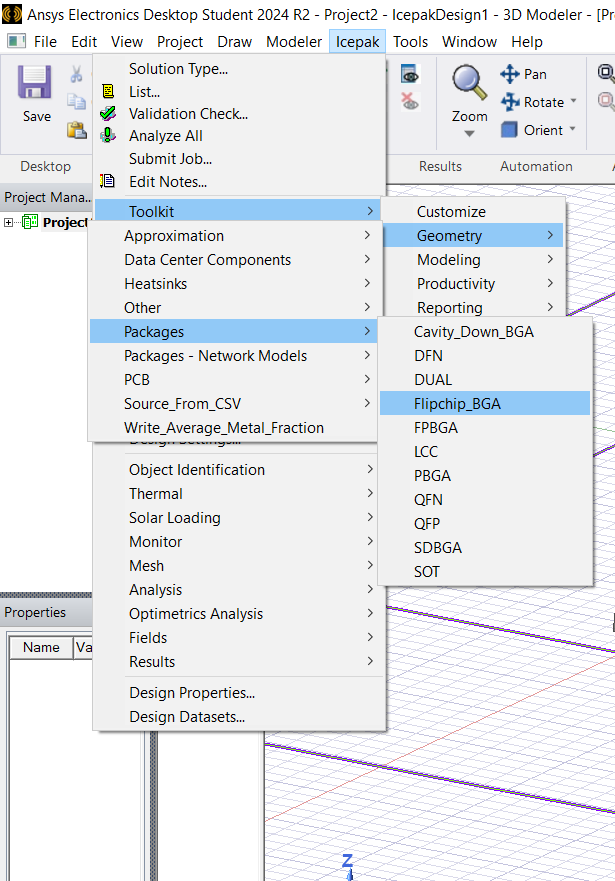

###set up the Die and the substrate and the solder 

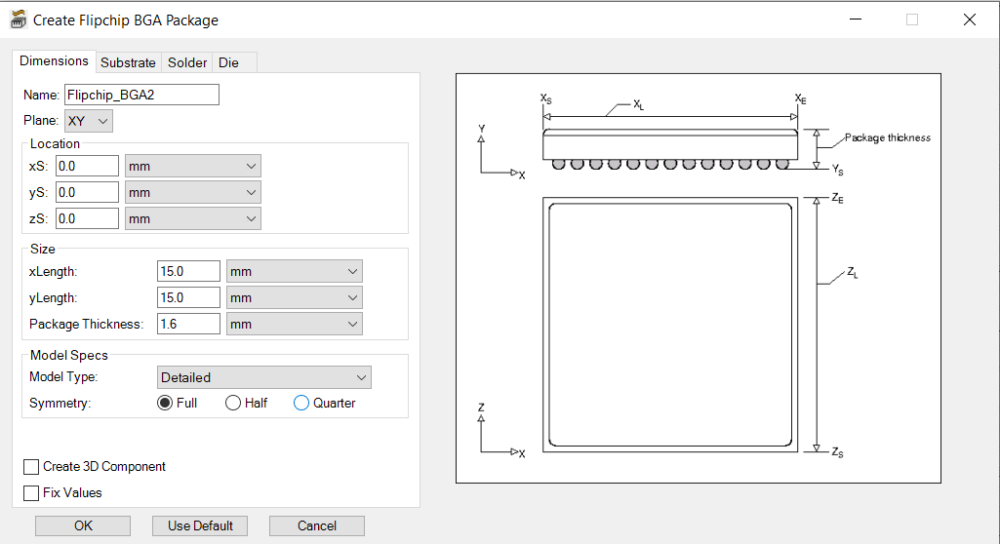

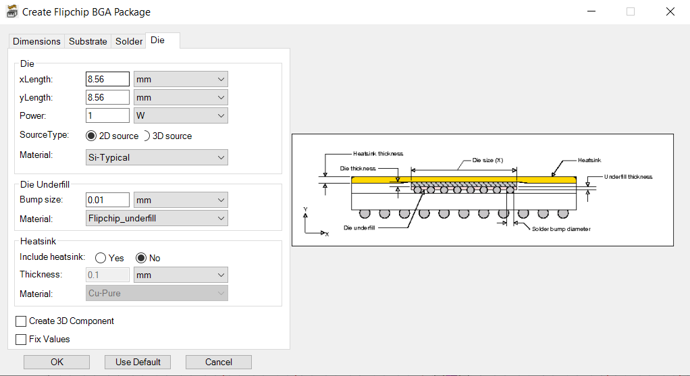

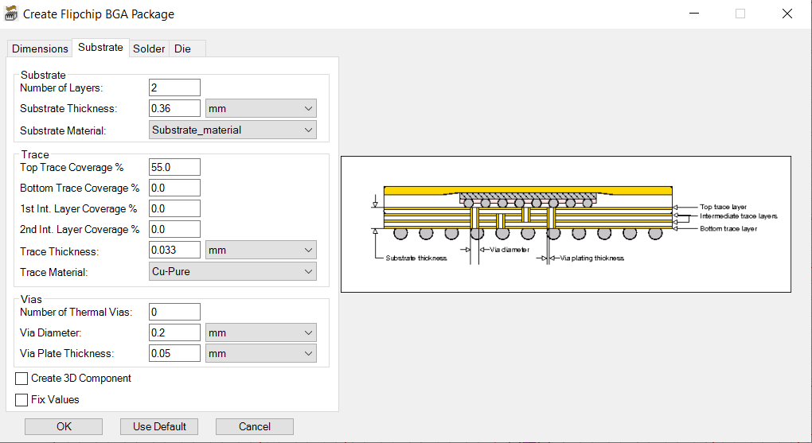

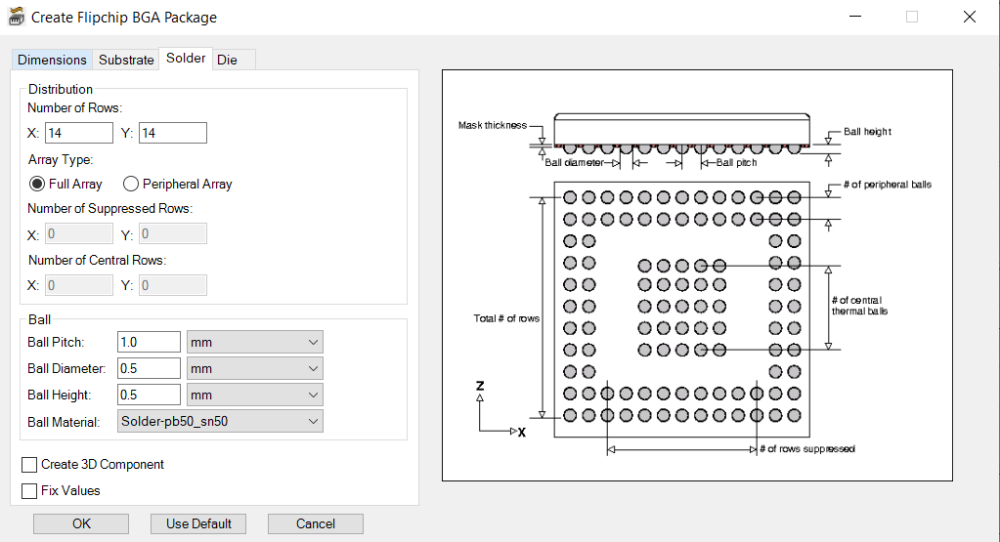

Next step is to add soources and boundries 

the source in this case was defined by the package with a deafult value 1W

and we define the boundry 

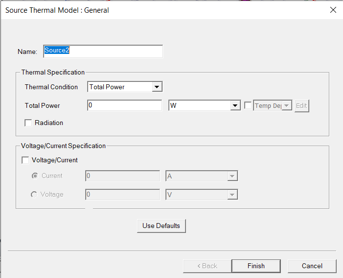

### meshing and analysis

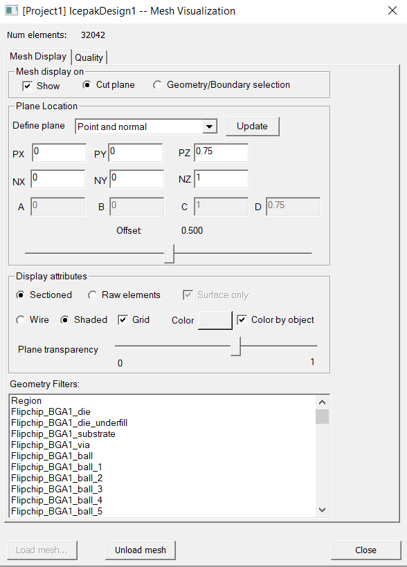

results :

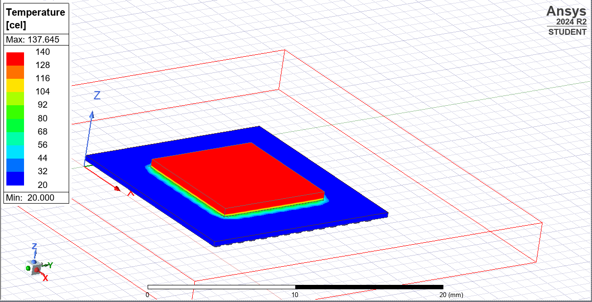

## Part III :Semiconductor Package Testing & Modeling with ANSYS

---

###  Package Testing & Reliability

#### Multi-Stage Testing Overview

Testing is conducted across various stages in the semiconductor lifecycle:

##### Foundry Stage
- **Wafer Probe Test**
  - Uses probe station and Automated Test Equipment (ATE).
  - Each die is tested via probe card.

##### OSAT Stage
- **Assembly and Functional Testing**
  - Die bonding, wire/flip-chip bonding, encapsulation.
  - Assembly Open and Short Test (AOST) checks for defects.
- **Burn-In Test**
  - Devices undergo thermal and voltage stress to expose early failures.
- **Final Test**
  - Comprehensive electrical and functional test after packaging.
- **System-Level Test (SLT)**
  - Evaluates devices in emulated real-world systems (e.g., inside mobile phone boards).

---

####  Reliability Tests

#### Burn-In Test
- **Purpose**:
  - Detect manufacturing defects
  - Improve reliability for mission-critical applications

- **Typical Conditions**:
  - Temperature: 125°C to 150°C
  - Voltage: 1.5× to 2× nominal
  - Duration: 24–168 hours
  - Controlled thermal chambers used

- **Common in**:
  - Automotive, aerospace, enterprise-grade ICs

#### Final Test (FT)
- Last stage of test after packaging
- **Process**:
  - Load devices into test handler
  - ATE interfaces and applies voltage/current/digital patterns
  - Execute DC, AC, functional, parametric tests
  - Devices are binned and marked for shipment

#### Automated Test Equipment (ATE)
- **Functions**:
  - Parametric: Current/voltage compliance
  - Functional: Logic and memory operations
  - Speed: Clock and delay testing

- **Metrics**:
  - Test coverage
  - Yield
  - Execution time

---

###  Package Modeling in ANSYS AEDT

#### Objective
Model a complete wire-bond semiconductor package cross-section using ANSYS Electronics Desktop.

#### Package Manufacturing Flow

1. **Wafer Reception**
   - Verify wafer ID, surface, and warpage.
   - Store in FOUPs or cassettes.

2. **Wafer Backgrinding**
   - Reduce thickness with backside grinding.

3. **Wafer Dicing / Singulation**
   - Mechanical or laser separation of dies.

4. **Die Attach**
   - Die is mounted using epoxy or die attach film.

5. **Interconnect / Die-to-Package Connection**
   - **Wire Bonding**: Uses gold, copper, or aluminum wires.
   - **Flip-Chip Bonding**: Solder bumps connect die directly.

6. **Encapsulation / Molding**
   - Epoxy molding compound protects die and wires.

7. **Marking**
   - Laser or ink used to apply lot number and traceability data.

8. **Package Singulation**
   - Post-mold dicing separates the packages.

9. **Final Test**
   - Devices tested and sorted using ATE.

10. **Packing & Shipping**
    - Devices packed in trays or reels and shipped with labels.

## Creating Dice and substrate in ADET 

###  Steps to Create a Die in ANSYS Electronics Desktop (AEDT)

This guide walks you through creating a simple die (chip) model using ANSYS AEDT.

---

#### Step 1: Launch ANSYS Electronics Desktop

1. Open **ANSYS Electronics Desktop (AEDT)**.
2. Choose a project type:
   - `Icepak` – for thermal analysis
   - `HFSS 3D Layout` – for electromagnetic analysis
   - `Q3D Extractor` – for parasitic extraction
3. Create a **new project** and insert a **new design**.
4. Set the **working units**:
   - Navigate to `Modeler → Units`
   - Choose `mm` or `μm` (for package-level modeling)

---

#### Step 2: Create the Die Geometry

1. Use the **Draw → Rectangle** tool to draw the base of the die.
2. Set the rectangle dimensions:
   - **Width**: `3 mm`
   - **Height**: `3 mm`
   - **Position**: `(0, 0, 0)` (centered origin)
3. Apply thickness:
   - Go to `Modeler → Surface → Thicken Sheet`
   - Set thickness to `0.2 mm` (representing post-thinning)
4. Rename the object (e.g., `Die`) for clarity.

---

#### Step 3: Assign Material Properties

1. Navigate to `Modeler → Assign Material`.
2. Choose `Silicon` from the built-in material library.
   - Optionally, define a **custom material** if needed.
3. Apply the material to the die geometry.

 creating Die and substrane much similar to each other starting with drawing rectangle then setting what size we need it then add thikness to is and choosing after that what material we want to the component .
 for Die we are chosing silicon and for substrate we choose epoxy and then we add layer in between as die attach
 
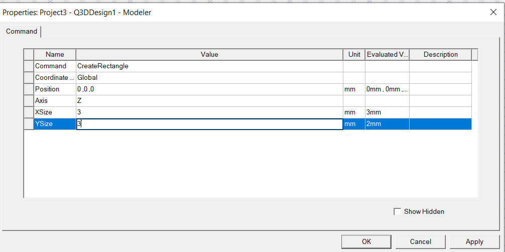

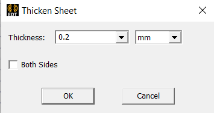

Final Form

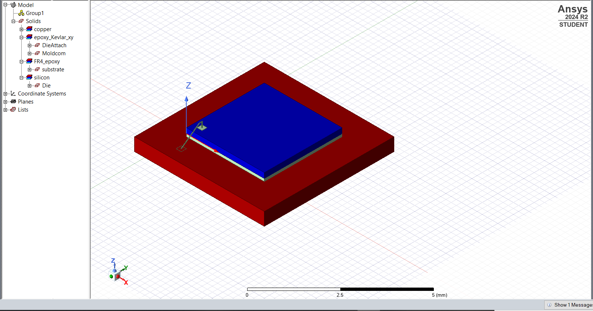

Add mold component
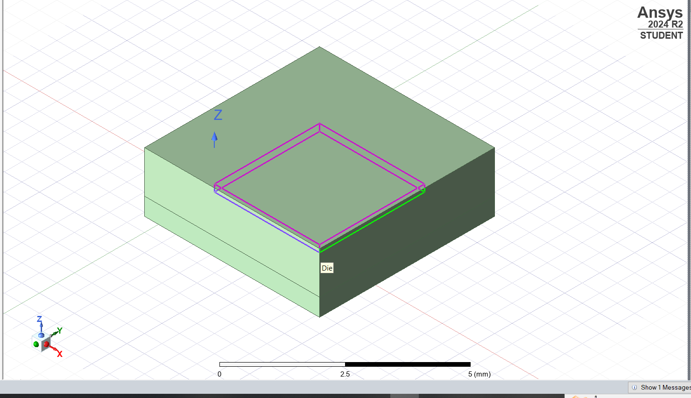

### analysis and Results 
After finishing our Design we run same meshing and analysis as the previous Lab and getting :

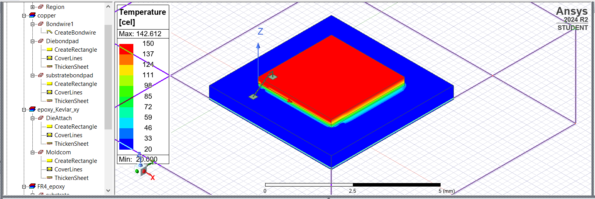

***** Note the mold component exsist but hiden to show better image 

